# 降压电路设计

## 12V转5V

利用ti的TPS63060将12V电压转至5V，TPS6306x 具有 2A 开关电流的高输入电压降压/升压转换器 数据表 (Rev. C)的开发网址是https://www.ti.com.cn/document-viewer/cn/tps63060/datasheet。设计电路的原理图如下：

  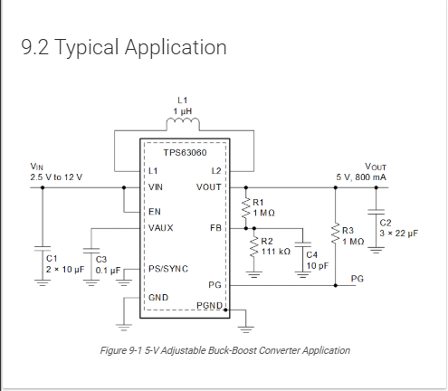

上图是12V转5V经典电路设计原理图

  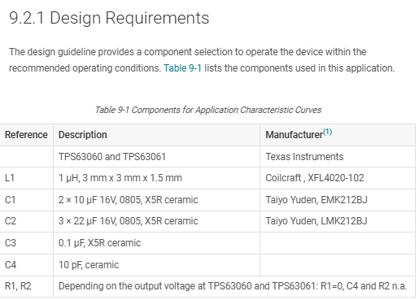

上图是元器件清单

TPS63060 典型应用电路元器件功能详解
    芯片：TPS63060
    升降压 DC-DC 转换器，输入 2.5~12V，本例输出 5V/800mA；输入低于输出时升压、输入高于输出时降压，实现单芯片升降压供电。
输入侧元器件
C1：2 颗 10μF 16V X5R 陶瓷输入主电容
    作用：输入大容量储能滤波
    平滑 VIN 母线电压，抑制电源进线的电压跌落、纹波；
    芯片开关瞬间提供瞬时大电流，降低线路阻抗压降；
    吸收前端电源的高频干扰，避免噪声串入芯片。
C3：0.1μF X5R 陶瓷去耦电容
    作用：高频旁路滤波
    靠近芯片 VIN、EN、VAUX 引脚，滤除 MHz 级高频开关噪声，弥补大容量电解 / 陶瓷电容高频特性差的缺陷，稳定芯片内部供电。
L1：1μH 功率电感
    升降压拓扑储能核心元件
    升压阶段：开关导通储存磁场能量，关断时释放能量抬升输出电压；
    降压阶段：缓冲开关管电流，平滑输出电流，抑制开关纹波；
    芯片内部 L1、L2 引脚接电感两端，构成升降压能量转换回路。
    反馈环路（稳压控制）元器件
R1 (1MΩ)、R2 (111kΩ)：输出分压采样电阻
    功能：输出电压采样
    将 VOUT 分压送入 FB 反馈引脚，芯片内部基准对比分压电压，自动调节占空比稳定输出；
    本例分压配比对应 5V 固定输出，更换阻值可调整 VOUT 大小。
C4：10pF 小电容（并联在 R2 两端）
    作用：反馈环路相位补偿
    抵消反馈网络相位滞后，防止电源环路自激振荡；
    滤除输出端高频尖峰干扰，避免高频噪声误触发稳压调节，提升瞬态响应稳定性。
输出侧元器件
C2：3 颗 22μF 16V X5R 陶瓷输出滤波电容
    作用：输出稳压、纹波抑制
    储存能量，负载突变时快速补充电流，减小输出电压波动；
    滤除开关频率带来的输出纹波，降低 VOUT 噪声；
    多颗并联等效低 ESR，大幅提升高频滤波效果。
PG 引脚相关：R3 (1MΩ 上拉电阻)
    PG（Power Good，电源正常指示引脚）
芯片内部为开漏输出：
    当 VOUT 稳定在额定值区间内，内部开关断开，R3 将 PG 引脚拉至高电平，代表电源输出正常；
    上电、短路、欠压时，PG 内部导通至 GND，引脚变低，可给 MCU 做电源就绪检测信号；
    R3 是开漏引脚必备上拉电阻，无 R3 则 PG 电平无法识别。
    芯片引脚连接说明（无源配套逻辑）
EN 引脚：直接接 VIN，芯片上电即持续使能工作；如需可控开关，可断开 EN 外接 MCU IO。
VAUX、PS/SYNC：直接就近接 C3 到地，做辅助电源、同步引脚高频滤波。
GND / PGND：功率地与信号地分开接地，PGND 承载电感大开关电流，单点接地减少地弹噪声干扰弱电反馈回路。
电感跨接 L1、L2 引脚，是升降压拓扑能量转换的核心通路。
整体电路逻辑总结：
    VIN 输入经 C1、C3 滤波后送入芯片；
    L1 完成电能 - 磁能转换，实现升降压变换；
    R1/R2 采样输出电压给 FB，闭环稳压；C4 保证环路稳定不振荡；
    C2 平滑输出 5V 电压，降低纹波；
    R3 配合 PG 引脚，输出电源就绪状态信号给后级系统。

## DIY电路设计原理

  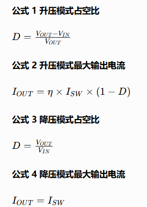

12V 转 5V / 12V 转 3.3V → 降压 Buck
输出电流能跑满 800mA；
电感压力小，散热更容易；
占空比低，开关损耗相对可控。
3V 转 5V / 2.5V 转 3.3V → 升压 Boost
低压输入时最大输出电流远不到 800mA；
电感峰值电流大，选型必须预留饱和余量；
相同负载下芯片温升更高。
输入比输出大 = 降压，带载强、电感压力小；
输入比输出小 = 升压，带载弱、电感要选更大饱和电流。

  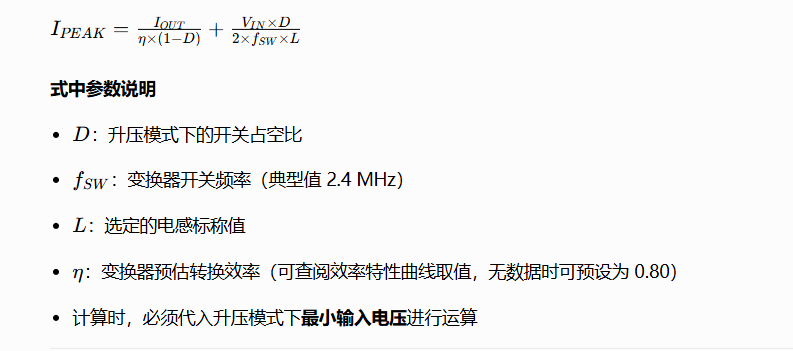

  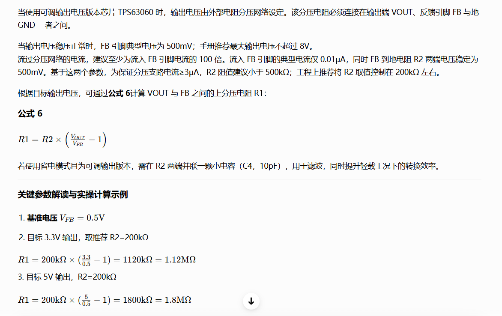

layout示例

  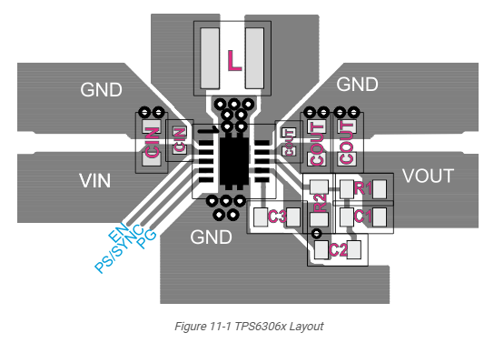

## 降压芯片封装及AN

官网网址https://www.ti.com.cn/cn/lit/an/zhcadf3c/zhcadf3c.pdf?ts=1783346358361

  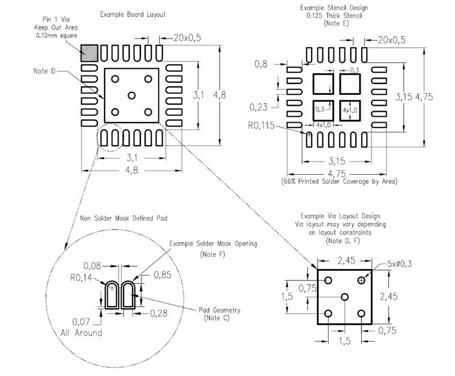

  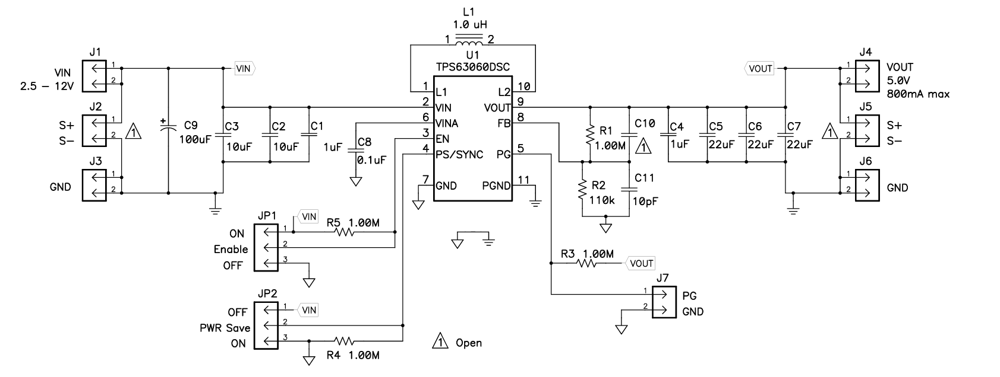

  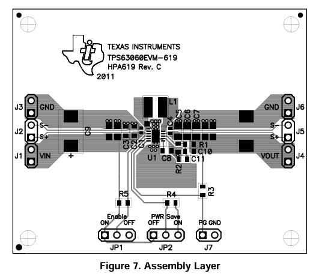

  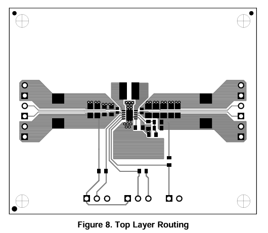

  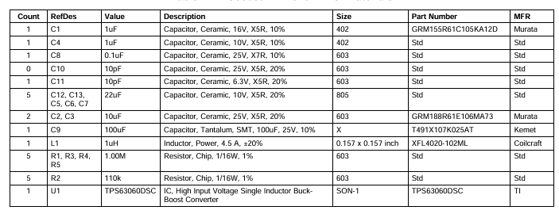

以上是11.1V转5V的电路设计，如果要转为3.3V输出，需要将R1为560k，R2为100K。

## 升压芯片封装及AN

升压芯片：https://www.ti.com.cn/cn/lit/ds/symlink/lmr62014.pdf?ts=1783431657431&ref_url=https%253A%252F%252Fwww.ti.com.cn%252Fproduct%252Fzh-cn%252FLMR62014%253FkeyMatch%253DLMR62014XMFX%252FNOPB%2526tisearch%253Duniversal_search%2526usecase%253DOPN-ALT

  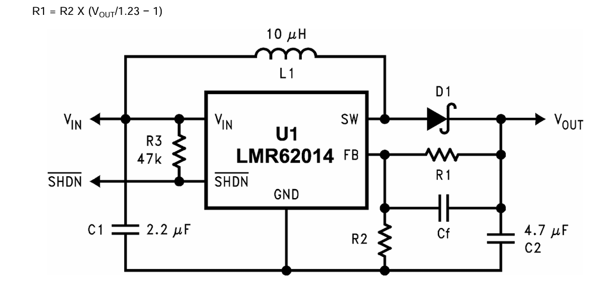

  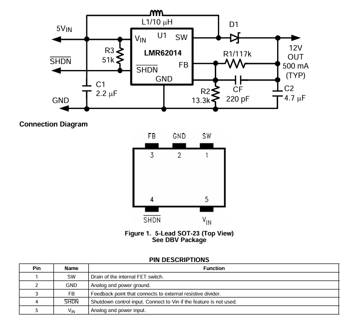

  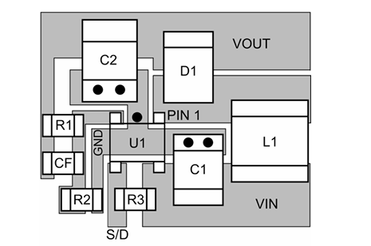

L1:10μH / ≥2A 屏蔽功率电感

D1:3A/40V 贴片肖特基

C1:2.2μF 陶瓷不变，并联一颗 10μF/16V 钽电容

C2:10μF/16V 贴片钽电容（T491 B/C 壳）
R1=117k、R2=13.3k、CF=220pF